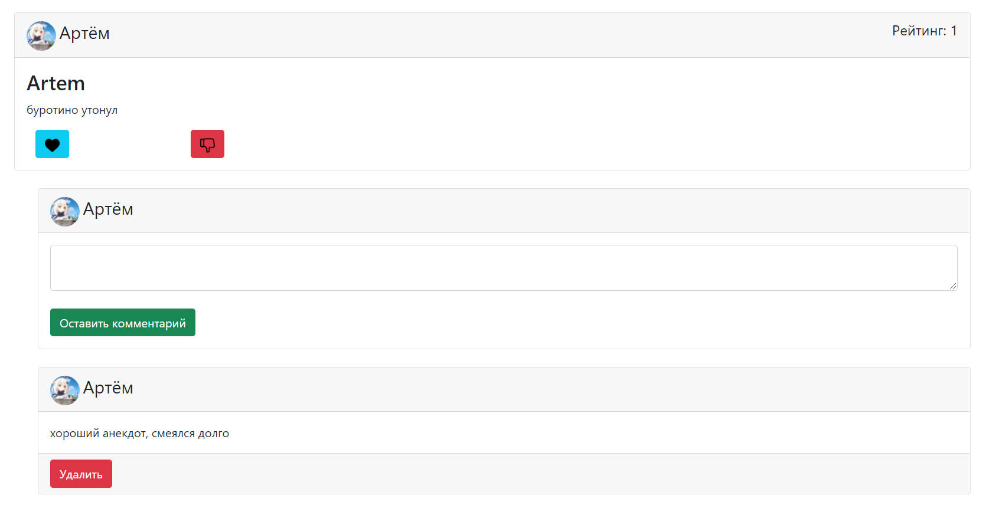
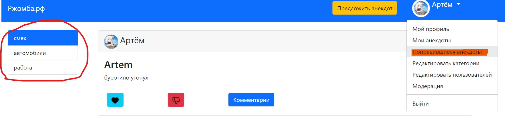
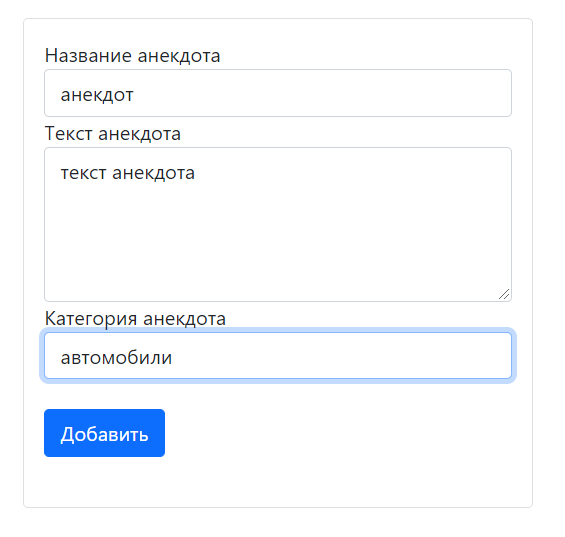
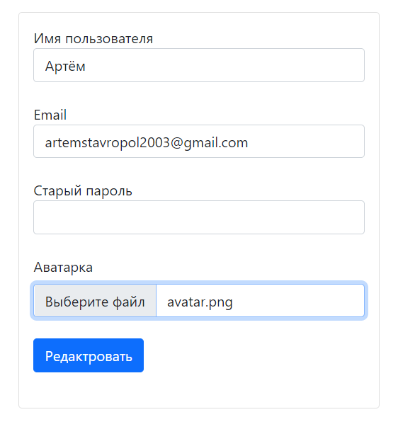
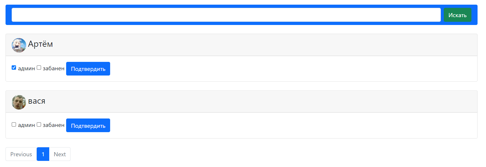
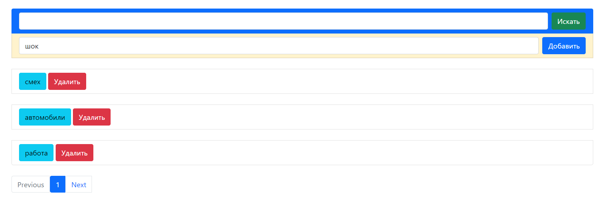

# Сайт с анекдотами
Идея нашего сайта заключена в создании подобия соц. Сети
 для анекдотов, в которой можно будет добавить свои анекдоты,
  оценивать их, комментировать и т.д.
## Функционал сайта
Наш сайт обладает довольно широким функционалом, основное 
это добавление анекдота, ну и конечно же оценивание его, 
комментирование, добавление категории анекдота.

Навигация сайта тоже присутствует, сортировка по категориям,
 просмотр лайкнутых анекдотов.
 
 

Что касается социальной стороны как уже говорилось, имеется
 возможность оставить комментарий, так же можно 
 редактировать свой профиль, менять аватарку, имя, 
 адрес электронной почты
 

 
 ## admin
 Как и на любом другом сайте у нас имеются админы, права 
 админа довольно широки, именно он модерирует анекдоты 
 перед публикацией, добавляет и удаляет новые категории, 
 может назначить и разжаловать админа и заблокировать 
 аккаунт.
 

## API настройка
- Перед началом работы с API сервисом создайте папку `db` в корневой дирректории(в папке с app.py), если таковая отсутствует.
- Для установки всех необходимых библиотек используйте команду `pip install -r requirements.txt` в терминале корневой папки.
- Запуск тестов сервера: `pytest` (в терминале папки с программой). Если не сработает, то `pytest test_api.py`

## API функционал
- API собой представляют полную реализацию работы сайта на языке запросов.
- Примеры запросов увидеть в файле `test_api.py`

# User

**Регистрация нескольких пользователей. Доступно только админу**

    json_request = {"data": [{"name": "Саша",
                                  "email": "test1@mail.ru",
                                  "password": "password1"},
                                 {"name": "Маша",
                                  "email": "test2@mail.ru",
                                  "password": "password2"},
                                 {"name": "Саша",
                                  "email": "test3@mail.ru",
                                  "password": "password3"}
                                 ]}

    response = client.post("/api/users", json=json_request,
                           auth=('user', 'pass'))
    response.status_code -> 201
    response.data -> {"users": [{"email": "test1@mail.ru"},
                                {"email": "test2@mail.ru"},
                                {"email": "test3@mail.ru"}]}

**Регистрация одного пользователя. Доступно всем**

    json_data = {"name": "Даша",
                 "email": "test4@mail.ru",
                 "password": "password4"}
    response = client.post("/api/users/personal_register", json=json_data)
    response.status_code -> 201
    response.data -> {"email": "test4@mail.ru"}

**Патч Пользователя**

    json_request = {"name": "Саша"}
    response = client.patch("/api/users/3", json=json_request,
                            auth=('user', 'pass')})

    response.status_code -> 200
    response.data -> {"user": {"name": "Саша",
                                "email": "test2@mail.ru",
                                "id": 3}}

**Бан Пользователя. Доступно только админам**

    response = client.delete("/api/users/3",
                             auth=('user', 'pass'))

    response.status_code -> 200
    response.data -> {"banned_id": 3}

# Anecdote

**Создание одного анекдота**

    json_data = {"name": "Test4",
                 "text": "test",
                 "category": "Улитка в баре"}

    response = client.post("/api/anecdote", json=json_data,
                           auth=('user', 'pass'))
    response.status_code -> 201

**Создание нескольких анекдотов сразу**

    json_data = {"data": [{"name": "Test1",
                           "text": "test",
                           "category": "Улитка в баре"},
                          {"name": "Test2",
                           "text": "test",
                           "category": "Улитка в баре"},
                          {"name": "Test3",
                           "text": "test",
                           "category": "Улитка в баре"}]}

    response = client.post("/api/anecdotes", json=json_data,
                           auth=('user', 'pass'))

    response.status_code -> 201
    response.data -> {"anecdotes": [{"name": "Test1"},
                                    {"name": "Test2"},
                                    {"name": "Test3"}]}

**Модерация анекдотов. Доступна только админам**

    json_data = {"anecdote_id": 1,
                 "is_published": 1}
    response = client.patch("/api/anecdotes/moderate", json=json_data,
                            auth=('user', 'pass'))
    
    response.status_code -> 200
    response.data -> {"id": 1}

**Получить рандомный анекдот**

    response = client.get("/api/anecdote")
    response.status_code -> 200
    response.data -> {"anecdote": {anecdote_data}}

# Category

**Создание категории. Доступно только админам**

    json_data = {"title": "Улитка в баре"}
    response = client.post("/api/categories", json=json_data,
                           auth=('user', 'pass'))

    response.status_code -> 201
    response.data -> {"title": "Улитка в баре"}

# Comment

**Создание комментария**

    json_data = {"anecdote_id": 1,
                 "text": "good anec"}
    response = client.post("/api/comments", json=json_data,
                           auth=('user', 'pass'))
    response.status_code -> 201

**Удаление комментария. Доступно админу и создателю**

    json_data = {"comment_id": 1}
    response = client.delete("/api/comments", json=json_data,
                             auth=('user', 'pass'))
    response.status_code -> 200

# Likes

**Убрать/поставить лайк/дизлайк(в зависимости от параметра `value`)**

    json_data = {"anecdote_id": 1,
                 "value": -1}
    response = client.post("/api/likes", json=json_data,
                           auth=('user', 'pass'))
    response.status_code -> 201
